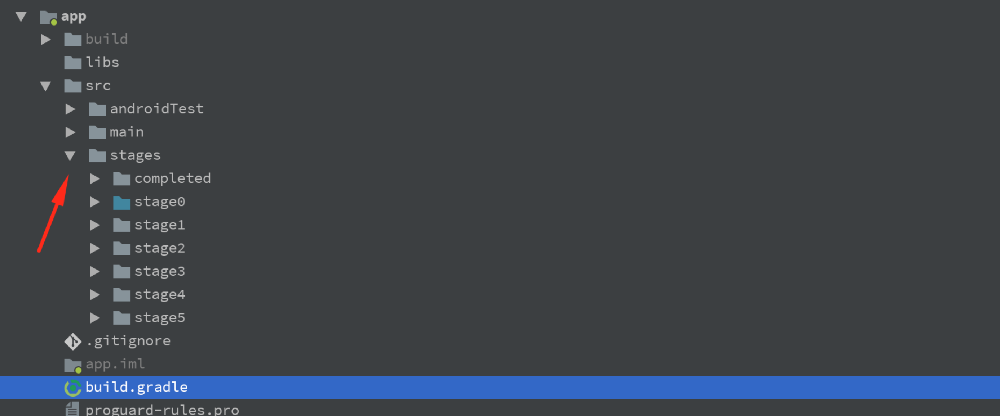
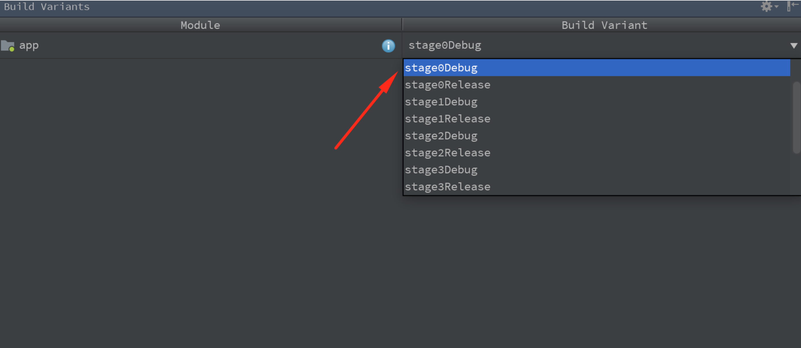

# AnimationsWorkshop


## Project structure

The project is separated into several stages using product flavors. Each stage represents 
some amount of work, that should be completed:



Begin from the 0th stage:



If you have lost focus or something just went wrong - select next stage and continue to work on it.

## Guide

### Stage 0 - Touches handling

The first essential thing we should implement is touches handling. 
To determine the state of the menu add the following variable in `WaveSideBar` and update `collapse()` 
and `expand()` functions:

```kotlin
private var isExpanded = false
```
```kotlin
fun collapse() {
  isExpanded = false
  Toast.makeText(context, "Menu collapsed", Toast.LENGTH_SHORT).show()
}

fun expand() {
  isExpanded = true
  Toast.makeText(context, "Menu expanded", Toast.LENGTH_SHORT).show()
}
```

Update `extesions.kt` file:

```kotlin
fun MotionEvent.isClick(startX: Float, startY: Float): Boolean {
    return Math.abs(this.x - startX) < 10 && Math.abs(this.y - startY) < 10
}

fun MotionEvent.isPulled(startX: Float, pullOffset: Float): Boolean {
    return this.x - startX > pullOffset
}

fun MotionEvent.isPulledBack(startX: Float, pullOffset: Float): Boolean {
    return startX - this.x > pullOffset
}
```
These functions will help us to determine the nature of a specific touch.

Override `onInterceptTouchEvent(event: MotionEvent)`. Here we should decide if we would handle 
a touch inside the view(return `true`) or would pass it to child views(return `false`). We want to handle touches 
if they're located near the left edge of the screen (to expand menu) and outside the menu (to collapse by click):

```kotlin
override fun onInterceptTouchEvent(event: MotionEvent): Boolean {
  val touchOutside = isExpanded && event.x > sideBarWidth
  val touchEdge = event.x < offset && !isExpanded 

  return touchEdge || touchOutside || super.onInterceptTouchEvent(event)
}
```
Add the following variables to store coordinates of `ACTION_DOWN` event:

```kotlin
private var startX = 0f
private var startY = 0f
```

To receive touch events override `onTouchEvent(event: MotionEvent)`:

```kotlin
override fun onTouchEvent(event: MotionEvent): Boolean {
  when (event.action) {
    ACTION_DOWN -> {
      startX = event.x
      startY = event.y

      if (event.x >= offset && !isExpanded) return false // we won't receive further ACTION_MOVE and ACTION_UP events
    }
    ACTION_MOVE -> {
    }
    ACTION_UP -> {
      if (!event.isClick(startX, startY)) {
        if (!isExpanded && event.isPulled(startX, pullOffset)) {
          expand()
        } else if (event.isPulledBack(startX, pullOffset)) {
          collapse()
        }
      }
    }
  }
  return true
}
```

Run the application. Now you can pull from left to right to change the state of the menu to expanded and from right to left
to collapse it. Also, notice, that when your menu is expanded, the list is not touchable, which is expected behavior.
To touch it, collapse the menu.


### Stage 1 - Cubic Bezier curve

Now it's time to start drawing! If we cannot approximate the needed curve using straight lines, we should use 
_Bezier curves_ of different orders or their conjunction. 

What is Bezier curve? It's a parametric curve, which is very frequently used in computer graphics. 
Its appearance depends on the position of its control points. You can easity draw them on 
`Canvas` using `cubicTo()` (for cubic curves) and `quadTo()` (for quadratic curves).

Add the following variables:

```kotlin
private var currentX = 0f // coordinates of current user's touch
private var currentY = 0f

private var paint: Paint? = null
private var path: Path? = null

// random values for gradient
// change these values to achieve another effect
private val gradient: LinearGradient
  get() = LinearGradient(600f, 0f, 0f, 1500f, startColorRes,
                endColorRes, Shader.TileMode.CLAMP)
```

Add the following function to prepare `paint` object:

```kotlin
private fun init() {
  paint.apply {
    shader = gradient
    isAntiAlias = true
  }
}
```

And add its invocation in the setter of the `view` variable:
```kotlin
var view: View? = null
  set(value) {
    field = value
    addView(value)
    value?.visibility = View.GONE
    init()
}
```

Declare `drawCubicBezierCurve(canvas: Canvas?)` function:

```kotlin
private fun drawCubicBezierCurve(canvas: Canvas?) {
  path.let {
    it.moveTo(0f, 0f)
    it.lineTo(0f, height.toFloat())
    it.lineTo(0f, height.toFloat())
    it.cubicTo(
      0f, currentY + 3 * offset, // first control point
      currentX, currentY + 3 * offset, // second control point
      currentX, currentY) // end point
    it.cubicTo(
      currentX, currentY - 3 * offset,
      0f, currentY - 3 * offset,
      0f, 0f)
    it.lineTo(0f, 0f)
  }
  canvas?.drawPath(path, paint)
}
```

Here we combine two cubic bezier curves to achieve more sinuous curve.

Override `onDraw(canvas: Canvas?)`:

```kotlin
override fun onDraw(canvas: Canvas?) {
  path.reset()

  if (!isExpanded) {
    drawCubicBezierCurve(canvas)
  }
}
```

Update the `onTouchEvent(event: MotionEvent)` function to force your view to redraw. To avoid too often updates, let's define 
`invalidateNeeded` variable:

```kotlin
    override fun onTouchEvent(event: MotionEvent): Boolean {
        currentX = event.x
        currentY = event.y

        var invalidateNeeded = false

        when (event.action) {
            ACTION_DOWN -> {
                startX = event.x
                startY = event.y

                if (event.x >= offset && !isExpanded) return false
            }
            ACTION_MOVE -> {
                invalidateNeeded = startX != currentX
            }
            ACTION_UP -> {
                if (!event.isClick(startX, startY)) {
                    if (!isExpanded && event.isPulled(startX, pullOffset)) {
                        expand()
                    } else if (event.isPulledBack(startX, pullOffset)) {
                        collapse()
                    }
                }
                invalidateNeeded = true
            }
        }

        if (invalidateNeeded) {
            invalidate()
        }
        return true
    }
```

Run the application. Now you can see a piece of menu while pulling it from left to right.


### Stage 2 - Expand animation

The next step is to create expand animation for our menu. And the main issue to solve is 
smooth transformation from two cubic bezier curves to straight line. Let's add an in-between step for this transformation -
quadratic bezier curve. 

First of all, let's define the following variables:

```kotlin
private var controlX = 0f // the x coordinate of the control point for the quadratic bezier curve

// the x coordinate of the start and end points for bezier curves
// that way we could animate it to expand and collapse menu
// if zeroX is 0 the menu is collapsed and only a piece of it is visible
// the larger its value the bigger part of the menu is already expanded
private var zeroX = 0f 
// the variable to store values [0, 1] opposite to the progress of expand animation. 
// that way we could make the transformation from cubic to quadratic bezier curve, and from quadratic bezier curve
// to straight line
private var invertedFraction = 1f
```

Create `drawQuadBezierCurve(canvas: Canvas?)` function:

```kotlin
    private fun drawQuadBezierCurve(canvas: Canvas?) {
        path?.let {
            it.moveTo(0f, 0f)
            it.lineTo(0f, height.toFloat())
            it.lineTo(zeroX, height.toFloat())
            it.quadTo(controlX, height / 2f, zeroX, 0f)
            it.lineTo(0f, 0f)
        }
        canvas?.drawPath(path, paint)
    }
```

And update `drawCubicBezierCurve(canvas: Canvas?)` to use `zeroX` and `invertedFraction`:

```kotlin
    private fun drawCubicBezierCurve(canvas: Canvas?) {
        path?.let {
            it.moveTo(0f, 0f)
            it.lineTo(0f, height.toFloat())
            it.lineTo(zeroX, height.toFloat())
            it.cubicTo(
                    zeroX, currentY + 3 * offset,
                    zeroX + currentX * invertedFraction, currentY + 3 * offset,
                    zeroX + currentX * invertedFraction, currentY)
            it.cubicTo(
                    zeroX + currentX * invertedFraction, currentY - 3 * offset,
                    zeroX, currentY - 3 * offset,
                    zeroX, 0f)
            it.lineTo(0f, 0f)
        }
        canvas?.drawPath(path, paint)
    }
```

Update `ACTION_MOVE` case in `onTouchEvent(event: MotionEvent)`:

```kotlin
ACTION_MOVE -> {
  invalidateNeeded = startX != currentX
  controlX = max(currentX, sideBarWidth - offset)
}
```

Update `onDraw(canvas: Canvas?)`:
```kotlin
    override fun onDraw(canvas: Canvas?) {
        reset()

        if (isExpanded) {
            drawQuadBezierCurve(canvas)
        } else {
            drawCubicBezierCurve(canvas)
        }
    }
```

Create `OnAnimationFinishedListener` inteface in a separate file:

```kotlin
interface OnAnimationFinishedListener : Animator.AnimatorListener {

    override fun onAnimationCancel(animation: Animator?) = Unit

    override fun onAnimationStart(animation: Animator?) = Unit

    override fun onAnimationRepeat(animation: Animator?) = Unit

}
```

Now we can use `AnimatorListener` without implementing all the callbacks.

Create `SpringInterpolator` class:

```kotlin
class SpringInterpolator : Interpolator {

    var factor = 0.4f // the bigger value the less amplitude

    override fun getInterpolation(x: Float): Float {
        return (Math.pow(2.0, -10.0 * x) * Math.sin((x - factor / 4) * (2 * Math.PI) / factor) + 1).toFloat()
    }

}
```

Visit this site to create your own interpolator http://inloop.github.io/interpolator/

Update `expand()` function (to animate `zeroX` and move the menu horizontally) 
and create `finishExpandAnimation()` (to straighten the curve and add bounce effect):

```kotlin
    fun expand() {
        ValueAnimator.ofFloat(0f, sideBarWidth).apply {
            duration = expandAnimationDuration / 2
            addUpdateListener {
                zeroX = animatedValue as Float
                invertedFraction = 1 - animatedFraction
                invalidate()
            }
            addListener(object : OnAnimationFinishedListener {
                override fun onAnimationEnd(animation: Animator?) {
                    finishExpandAnimation()
                    isExpanded = true
                }
            })
        }.start()
    }

    private fun finishExpandAnimation() {
        ValueAnimator.ofFloat(currentX, sideBarWidth).apply {
            duration = expandAnimationDuration / 2 + 200
            interpolator = SpringInterpolator()
            addUpdateListener {
                controlX = animatedValue as Float
                invalidate()
            }
        }.start()
    }
```

Run the application. Now our menu can smoothly expand


### Stage 3 - Collapse animation

Update `collapse()` function:

```kotlin
    fun collapse() {
        ValueAnimator.ofFloat(sideBarWidth, 0f).apply {
            duration = collapseAnimationDuration
            addUpdateListener {
                zeroX = animatedValue as Float
            }
        }.start()
        ValueAnimator.ofFloat(sideBarWidth, 0f).apply {
            duration = collapseAnimationDuration + 100
            interpolator = BounceInterpolator()
            addUpdateListener {
                controlX = animatedValue as Float
                invalidate()
            }
            addListener(object : OnAnimationFinishedListener {
                override fun onAnimationEnd(animation: Animator?) {
                    isExpanded = false
                    clearData()
                }
            })
        }.start()
    }
```

And add the following function to clear all values:

```kotlin
    private fun clearData() {
        zeroX = 0f
        invertedFraction = 1f
        controlX = 0f
        currentX = 0f
        currentY = 0f
    }
```

Run the application. Now the menu can also be collapsed.


### Stage 4 - Content animation

Add the following functions to create circular reveal animations for the content of our menu:

```kotlin
    private fun showContent() {
        ViewAnimationUtils.createCircularReveal(
                view, 0, height / 2, 0f, height.toFloat())
                .apply {
                    duration = expandAnimationDuration
                    view?.visibility = View.VISIBLE
                }.start()
    }

    private fun hideContent() {
        ViewAnimationUtils.createCircularReveal(
                view, 0, height / 2, height.toFloat(), 0f)
                .apply {
                    duration = collapseAnimationDuration / 4
                    view?.visibility = View.VISIBLE
                    addListener(object : OnAnimationFinishedListener {
                        override fun onAnimationEnd(animation: Animator?) {
                            view?.visibility = View.GONE
                        }
                    })
                }.start()
    }
```

Invoke them in `expand()` and `collapse()` respectively: 

```kotlin
    fun collapse() {
        hideContent()
        ...
    }

    fun expand() {
        showContent()
        ...
    }
```


### The last stage - overlay

It's important to bring user's attention to the menu content while it's expanded, not to the content underneath. 
Let's create an overlay to hide the content.

Create the following variables to draw an overlay:

```kotlin
private var overlayPaint = Paint()
private var overlayPath = Path()
```

Update `init()`:
```kotlin
    private fun init() {
        paint.apply {
            shader = gradient
            isAntiAlias = true
        }
        overlayPaint.apply {
            color = ContextCompat.getColor(context, R.color.grey)
            style = Paint.Style.FILL
        }
    }
```
Create the following functions:

```kotlin
    private fun drawOverlay(canvas: Canvas?) {
        updateOverlay()
        overlayPath.let {
            it.moveTo(0f, 0f)
            it.lineTo(0f, height.toFloat())
            it.lineTo(width.toFloat(), height.toFloat())
            it.lineTo(width.toFloat(), 0f)
            it.lineTo(0f, 0f)
        }
        canvas?.drawPath(overlayPath, overlayPaint)
    }

    private fun updateOverlay() {
        overlayPaint.let {
            it.reset()
            it.color = ContextCompat.getColor(context, R.color.grey)
            it.alpha = Math.min(((currentX / width) * 255).toInt(), 80)
            it.style = Paint.Style.FILL
        }
    }
```
And update `onDraw(canvas: Canvas?)`:

```kotlin
    override fun onDraw(canvas: Canvas?) {
        reset()

        drawOverlay(canvas)

        if (isExpanded) {
            drawQuadBezierCurve(canvas)
        } else {
            drawCubicBezierCurve(canvas)
        }
    }

    private fun reset() {
        path.reset()
        overlayPath.reset()
    }
```

It seems as if that's all! Run the application


